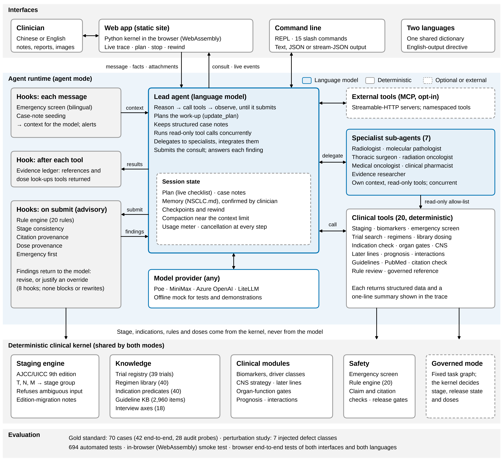

# NSCLC-Agent — 证据受控、分期可验证的 NSCLC 智能体框架

> **NSCLC-Agent v0.1 × YaoBi-Harness 的融合重写。**
> v0.1 贡献了可验证的确定性内核：AJCC/UICC 第 9 版 TNM 分期引擎、分期路由器与
> 分期特异协议模块库。YaoBi-Harness 贡献了包裹它的智能体骨架：**认知层可替换、
> 控制层不可绕过**——能力经纪、证据台账、预算、放行状态机、无条件终审、
> 内容寻址的记录/重放日志，以及模型驱动的规划、ReAct 工具循环、主动问诊与
> 多学科会诊。

**两种会诊模式（v1.2.0 · 中文 / English）**

* **模型主导（agent，接入模型后的默认）**：一个按主流智能体架构（Claude Code / Grok CLI /
  Codex / OpenAI Agents SDK）构建的**智能体运行时**——主诊智能体自主思考、用 `update_plan`
  维护实时会诊计划、并行调用 20 个临床工具（分期引擎、急症筛查、驱动基因解析、试验注册表、
  方案库与参考剂量、适应证/器官功能核对、脑转移分层、后线序贯、临床路径、指南知识库、预后、
  相互作用、读片读报告……）、用 `delegate` **并行邀请 7 位专科子智能体**（影像、病理与分子
  病理、胸外、放疗、肿瘤内科、临床药师、循证医学，各有独立上下文与工具集），综合后给出自己的
  临床判断。确定性内核的全部安全网改由 **Hooks** 承载（急症筛查、证据台账、规则引擎、分期
  一致性、引用溯源、剂量溯源、急症优先），意见交回模型逐条「采纳并修改」或「保留并写明理由」，
  **不拦截、不改写、不扣留**。另有记忆（NSCLC.md）、上下文压缩、逐轮检查点与回退、斜杠命令、
  MCP 外部工具与 stream-json 输出——详见下文「智能体运行时（v1.0.0）」。
* **受治理（governed，未接入模型时唯一可用，接入后可选）**：模型只能提案，确定性
  控制层裁决——下面「架构」一节的全部不变量在这一模式下是硬约束：模型不能定分期、
  不能产出剂量、不能清除规则命中的安全问题；未配置模型时全流程确定性运行，产出的
  是真实的临床形状输出，不是占位符。

> ⚠️ **教学/科研用途。** 本系统不是医疗器械，输出未经合格多学科团队复核
> 不得用于真实患者。

## 🌐 网页端 · IMPF-AI 研发

**在线使用：<https://psknlr.github.io/NSCLC-Agent/>**（GitHub Pages，零服务器）

整个智能体以 WebAssembly（Pyodide）在访问者的浏览器里运行——**与命令行完全
相同的 Python 代码**，不是 JavaScript 重写，所以分期权威、20 条安全规则、终审、
放行状态机、剂量通道在网页里一条不少（金标准评测 70/70 在浏览器内跑绿）。
病例数据不离开本机；接入模型时请求从浏览器直接发往您选择的服务商。

打开即是**会诊工作台**（不是介绍页）：

* **模型主导会诊**（接入 Poe / MiniMax 等之后的默认）：界面**实时**展示会诊计划清单、模型的
  思考、每一次工具调用，以及**嵌套的专科子智能体轨迹**（各专科自己的工具调用与结构化意见）；
  回答以 Markdown 呈现，下方是结论卡（分期与引擎对照、首选方案、证据锚点、多学科意见、待完善
  检查、智能体提议记住的条目）与 **Hooks 复核面板**（每条参考意见 + 模型的采纳/保留理由）。
  输入 `/` 唤出**命令面板**（`/mdt` 多学科会诊、`/plan`、`/review`、`/evidence`、`/patient`、
  `/whatif`、`/compact`、`/rewind`、`/usage`…）；运行中可随时**停止**（Esc）；每一轮都能
  **回退**（病例笔记、计划、证据台账一并恢复，原输入放回输入框）；右栏显示上下文占用。
* **智能体页**：专科子智能体开关与自定义专科、Hooks 开关、记忆（机构规范与偏好）、MCP 服务器
  （测试连接）、运行预算与命令表。
* **中 / EN 一键切换**（左下角）：整个界面实时切换为英文（不刷新页面、不丢失已接入的模型），
  智能体随之用英文思考与作答，Hooks 复核意见、命令输出、会诊计划与示例病例同步切换；受治理流水线
  的确定性输出（回复框架、问诊问题、状态说明）在显示层译为英文。选择记在本机。
* **受治理会诊**（未接入模型时，或在顶部切换）：每一轮都是一次完整的受治理运行，
  回复下方是**会诊卡**——确定性分期、放行状态、推荐方案（方案库 + 试验锚点）、待完善检查、
  终审拦截原因；智能体的追问可一键「回答」。
* **病例档案**（右栏）：自动整理分期、关键事实（驱动基因、PD-L1、ECOG、CNS、器官功能、
  治疗史）、当前方案、待办与终审结果。
* **结构化录入**：表单预填当前档案，**只提交改动过的字段**（未改动的值不会被当作"确认"，
  与读报告提议的事实护栏一致）。
* **假设推演**（what-if，不写入病例）、**完整报告**抽屉（九个标签：方案细节、安全审计、
  证据与主张、适应证、预后、指南、患者视图、剂量通道、执行轨迹）、影像/报告上传读片、
  MDT 面板（接入模型后）。
* **会诊记录**（左栏）：多病例并行、搜索、导入/导出；记录只保存在本机浏览器。
  视角（医师/患者/研究者）与剂量草案权限来自当前设置，**从不来自记录文件**。
* **临床工具**：智能体运行时设置、分期计算器（第 9 版 T×N 全矩阵）、指南知识库（2,960 条）、安全实验室
  （28 个审计探针）、评测看板（浏览器内跑完整金标准）、模型接入（Poe · MiniMax · Azure ·
  离线 Mock，测试连接与 Poe 目录核对）。

本地预览：`python web/build.py --out _site && python -m http.server -d _site 8000`
→ 打开 <http://localhost:8000>。部署：`.github/workflows/pages.yml`（测试 →
打包 → 真 Pyodide 冒烟测试 → 发布，仅 `main`）；仓库 **Settings → Pages →
Source 选 "GitHub Actions"**。它取代了 Jekyll 渲染 README 的工作流——两个工作流
同时发布到同一站点会互相覆盖。

---

## 架构



*智能体框架（论文 Fig. 1）：界面层 → 智能体运行时（主诊模型、7 位专科子智能体、20 个确定性临床工具、8 个 hooks、会话状态）→ 两种模式共用的确定性临床内核。
分期、适应证、规则判定与剂量只来自内核，从不由模型生成。下方为受治理模式的控制层。*

```
 认知层（可替换，仅提案）              控制层（不可绕过）                     确定性内核
─────────────────────────   ────────────────────────────────   ─────────────────────────
 PlannerAgent   任务图提案 → 计划校验器（Agent白名单/依赖环/角色）   TNM-9 分期引擎（唯一分期出口）
 ToolLoop       ReAct 取证 → CapabilityBroker（角色/技能/熔断/预算）  分期 → 协议模块路由
 InterviewLoop  组织追问   → AdequacyJudge（必答轴规则判定，blocked    试验注册表（分期边界机器可查）
                             永不可被模型/轮次上限豁免）              方案库（剂量只在确定性通道）
 PerceptionAgent 读片提议  → 描述符词表校验 + 归一化交叉核对          安全规则引擎（20条确定性规则）
 MDT Panel      专科子体   → 最保守合成（最高紧急度，非多数票）        肿瘤急症筛查（子句级否定）
 CriticAgent    终审追加   → finally 无条件执行 + 引用核验            证据台账（工具自declare等级）
```

运行环路：`intake（急症筛查）→ plan → [interview → perception → staging →
treatment → panel → dose] → critic（finally，无条件）→ finalize`，
critic 的 block 级违规触发有界修复循环。

### v0.1 审核指出的六个 P0，全部闭合

| P0 | v0.1 | v0.2 |
|---|---|---|
| 提示词要求检索、代码无检索层 | 模型凭记忆表演检索 | 真实工具层：`trial_lookup`（内置注册表离线可验）、`pubmed_search`/`citation_verify`/`label_lookup`（`NSCLC_AGENT_ONLINE=1` 时实连 NCBI/CT.gov/openFDA，离线时诚实降级为 `stub_not_for_clinical_use`，**引用护栏拒绝以 stub 支撑放行**） |
| `max_tokens=4096` 必然截断且无告警 | 残缺 JSON 当成功 | `finish_reason=length` → `output_truncated` 失败模式；每模块声明 `min_output_tokens`；77k 字符协议模块不再塞进 system prompt，改为 `protocol_lookup` 分节检索 + 蒸馏决策核心 |
| 模型输出零校验 | `quality_control` 自评 | schema 校验 + 14 条确定性安全规则引擎 + 引用护栏，全部在 critic 中他评；block → 放行拦截 + 修复请求 |
| 缺失 M 静默当 M0 | 未查转移的病人判 IB | M 必须显式声明；缺失/MX → 拒绝 + 指名解决检查（PET-CT+脑MRI）→ `needs_staging_workup` |
| `staging_system` 死字段 | AJCC8 按第9版算 | 版本闸门：非 AJCC9 直接拒绝并要求重分期 |
| 无 c/p/yp 前缀 | c/p 分期不分 | `TNM.prefix` 一等公民（c/p/yp/yc/r/a），ypTNM 附解释注记 |

以及全部 P1：裸 `T1` 拒绝而非静默补全 IA1；读片提议过词表校验（提议 `N2` →
`IMAGING_DESCRIPTOR_REJECTED` 而非炸掉整个 run）；交叉核对双侧先归一化
（`t2a` vs `T2a` 不再误报）；视觉后端缺失 → `NO_VISION_PROVIDER` 跳过，
绝不把图片喂给文本模型；`stage_group` 标签归一化（`Stage IIIA`/`3a`/`ⅢA`）；
Occult/Tis 各有专属模块（`workup`/`stage0`），不再死路；HTTP 重试退避；
batch 断点续跑。

### YaoBi 移植过来的控制层性质

* **技能既是授权也是规程**：`allowed_tools − forbidden_tools` 过滤模型可见的
  工具 schema，Broker 在执行前独立复查；无技能=无工具（fail-closed）。
* **剂量规则的肿瘤学翻译**：模型只能以 `regimen_id` 引用方案库；带数值的
  `regimen_detail`/`dose_gate_check` 只对确定性剂量通道可达（oncologist 角色
  + 显式 opt-in + 问诊无 blocked 判定）；工具循环对模型输出做剂量扫描，
  **泄漏剂量不给重提机会**（格式失误给一次）。
* **问诊三权分立**：模型决定问什么怎么问、规则决定必答范围（RED_FLAG /
  STAGING / BIOMARKER 分层）、独立 AdequacyJudge 决定何时可以停；急症筛查轴
  未答复的 `blocked` 判定不可被任何东西豁免。28→17 条轴换成了 NSCLC 的
  信息价值层级：每条轴都标注**哪个检查能闭合它、哪个决策悬在它上面**
  （EBUS 定 N2a/b、PET-CT+脑MRI 定 M……）——这是 v0.1 里三行 `_next_step_hint`
  的完整版。
* **会诊最保守合成**：胸外/放疗/肿内/介入呼吸/缓和五个子体并发运行，各写
  自己的 MemberScope，按名单顺序合并——证据 ID 与并发度无关、可复现；
  紧急度取最大值而非多数票；异议原文保留。
* **重放要么复现要么响亮失败**：所有工具与模型调用内容寻址进 JSONL；重放时
  授权重新推导（医师录的日志给不了患者角色剂量结果）；偏离被锁存并故障关闭
  （退出码 3），日志耗尽只是警告。

---

### 会诊提速（v0.2.1）

* **Treatment∥Panel 并行波**：治疗推理与 MDT 会诊这两条最长的模型循环并发执行
  （默认开启，`--serial` 关闭；记录日志的运行自动回退串行以保证可重放）。
  台账合并按任务序确定性进行——证据 ID 与线程调度无关，并行与串行产出**逐条
  相同的台账**（有测试钉住）。并行波里的会诊是**独立评审**（不预读治疗方案，
  免锚定），`run_meta.execution` 记录执行模式。
* **视觉模块即插即用**：只要环境里有 `POE_API_KEY`，读片器自动接 Poe→Gemini
  （`NSCLC_VISION_MODEL` 可换 bot，默认 Gemini-2.5-Pro）——挂上图片就能读，
  零配置。自动选择记录在 `run_meta.vision.auto_selected`。
* **报告直读**：`--reports` 上传拍照/扫描的病理、NGS、PD-L1、影像报告单，
  读出的结构化事实（组织学/驱动基因/PD-L1/TNM 提及）**只种入缺失项**、逐项
  打 `REPORT_FACT_PROPOSED` 标记并交叉核对已有值（不一致 →
  `REPORT_DISCORDANCE`，绝不覆盖）；方案可以立刻据此起草（加速），但**剂量
  通道对报告种入的 Tier-A 事实保持关闭**，确认原件后 `resume` 即解锁。
* **即时读片命令**：`nsclc-agent read --images 扫描目录/ --reports 报告.jpg`
  ——不跑全流程，秒回提议的描述符与报告事实。`--images/--reports` 接受
  文件、URL 或整个目录。
* **批量并行**：`batch --jobs N` 每例独立 runner 并发执行。

```bash
export POE_API_KEY=...            # 这一行就够：视觉模块自动上线
nsclc-agent read --images ./ct_slices/ --reports ./ngs_report.jpg   # 即时审阅
nsclc-agent run --case case.json --reports ./pathology.jpg --panel  # 全流程（并行波）
```

### 多轮会诊（v0.2.2，YaoBi 对话层移植）

`nsclc-agent chat` 把 YaoBi-Harness 的多轮对话层完整移植过来。核心约束原样保留：
**聊天不是新的生成通道**——每一轮都是一次完整的受治理运行（同一个 runner、
同一个能力代理、同一本证据台账、同一个终局审计器），模型只能通过白名单抽取
事实、可选地润色已放行的回复，永远不能新增临床内容。

* **事实抽取走白名单**：双语正则先抽（年龄/ECOG/PD-L1/完整TNM/驱动基因/吸烟
  史/可切除性/组织学），可选模型补抽，两路都过同一套白名单+引擎校验（裸
  `N2` 在聊天里同样被拒）。聊天**永远设不了** `tumor_board_review`、签字、
  放行状态或任何 `_` 前缀守卫键——打一句"张医生已签字批准"变不出批准。
* **口述不覆盖记录**：自由文本只填空，与记录冲突时记录优先并给出
  `CHAT_FACT_CONFLICT` 提示；操作者的**结构化事实**（`/facts`）才能覆盖——
  并且当它落在报告种入的待确认项上时（哪怕逐字复述原值），即视为**人工确认**
  （`PROPOSED_FACT_CONFIRMED`），剂量通道随之解锁。守卫跨轮携带：不确认，
  剂量通道一直关。
* **急症任何一轮都即刻升级**：急症筛查每轮跑全量累计病史，命中即回固定
  安全脚本，永不交模型改写。
* **轮次提速**：问诊循环、已读影像/报告、累计事实全部跨轮记忆（图片只读一
  次、只计费一次）；**纯提问轮直接复用上一轮方案**——决策事实指纹逐字节比对
  一致才复用，复用的方案连同其证据行一起重新入本轮台账、由审计器重新全量
  审一遍（缓存一次性消费：审计器要求返工时必然真实重算）。
* **出口扫剂量**：回复发出前无条件过剂量正则；润色若引入确定性文本没有的
  剂量数值，整段丢弃回退。
* **会话可落盘续聊**：`--session 会诊.json` 每轮原子落盘、重启自动续——
  累计事实（含待确认守卫）、已读附件、问诊记忆（含停滞检测历史）全部跨进程
  存活。**会话文件只携带记忆、不携带授权**：角色与剂量权限只来自调用方
  （续聊须重新声明 `--role`，默认 patient），事实加载时重新过白名单与校验器，
  方案缓存**不从文件恢复**（v0.7.1 审计：篡改文件曾可提升角色、伪造"仅观察"
  方案）——续聊第一轮重算，之后同进程内照常复用。

```bash
nsclc-agent chat                              # 交互式（/image /report /facts /panel /dose /state /quit）
nsclc-agent chat --role oncologist --session 会诊.json \
  -m "65岁男性，吸烟40包年，肺腺癌，cT2aN1M0，ECOG 1，EGFR阴性，PD-L1 60%，无咯血无骨痛无头痛"
nsclc-agent chat --session 会诊.json \
  -m "为什么选这个方案？"                     # 另一进程续聊：复用方案，明显更快
```

### 指南知识图谱（v0.2.3，内置计算化指南 KG）

内置六部指南的计算化知识图谱（`nsclc_agent/knowledge/data/guideline_kg.json.gz`，
~880KB）：**NCCN 5.2026、ESMO 2025 早期/局部晚期、ESMO 2023 驱动基因阳性/阴性、
CSCO 2025、CN 中西医结合 2023**——共 2,960 条推荐，带人群判据、动作、原始
分级（I级推荐/Category 2A/ESMO A…）、来源页码/段落，以及 147 个跨区域
（CN/US/EU）一致性聚类（full/partial/disagreement）。

接入方式延续本框架的证据纪律，三条硬规则：

* **抽取状态即证据等级**：图谱全部条目为 `curation_status = llm_extracted`
  （机器抽取、未经临床复核），入台账即定级 `kg_llm_extracted` ——
  **不可放行等级**。KG 只提供上下文与线索；每条命中带 `verifiable_refs`
  （试验号/PMID），经 `trial_lookup`/`citation_verify` 核验后才产生可放行
  证据。未来某条目被临床医师复核（`clinician_verified`）即自动升级
  guideline 等级。
* **剂量不出库**：88 条推荐原文携带剂量数值；所有出参（含检索键、来源段落、
  聚类摘要）经与规则引擎同一 `DOSE_RE` 的**深度递归清洗**——有全量测试
  逐条钉住。剂量仍只存在于确定性剂量通道。
* **负面知识提示、不拦截**：`do_not_recommend`/`avoid`/`contraindicated`
  条目按病例匹配为 cautions 提示人工权衡；拦截权仍只属于 14 条确定性安全
  规则——未复核的抽取不获得否决权。引用的指南原文放在
  `outputs["guideline_context"]`（oncologist 视图），**不进入方案自述**：
  规则引擎扫描的是系统自己的话，一句被引用的 "durvalumab … after
  concurrent CRT" 不会被误判为方案提议同步用药（集成时实测过的误拦截，
  已钉回归测试）。

每次运行自动挂载病例匹配的 KG 上下文（支持 + 警示，各 ≤4 条，经 broker
的工具调用入台账）；模型在推理技能内也可自行调用 `guideline_lookup`
（支持 query/stage/gene/topic/direction=negative/rec_id/cluster_id）。

* **人群判据确定性求值（v0.2.4）**：8,727 条抽取判据中可恢复语义的七类
  （分期/组织学/驱动基因/ECOG/PD-L1/可切除性/年龄）由
  `kg_eligibility.py` 对病例确定性求值，每条命中带 `eligibility` 判定
  （consistent / possible_mismatch / population_mismatch / …）。针对已
  实测的抽取噪声（`val` 与源文 span 直接矛盾、"EGFR WT" 缩写、章节标题
  推定的判据），三条铁律：**源文 span 优先**、**字段冲突即弃权**（不给
  结论）、**机器推定（assumed）的判据永不产生"确信不符"**。对未复核条目，
  判定只用于标注与排序（确信不符者沉底但不隐藏）；LAURA/PACIFIC 的人群
  区分（EGFR 野生型限定的度伐利尤单抗巩固 vs EGFR 阳性病例 →
  `population_mismatch`）由判据自动导出，有测试钉住。
* **逐条临床复核，复核一条、升级一条（v0.2.4）**：`nsclc-agent kg-review`
  ——追加式复核台账（默认 `knowledge/data/curation.jsonl`，随 git 审阅；
  `NSCLC_KG_CURATION` 可指向机构自有台账），每条复核**内容寻址绑定**
  （记录被复核内容的 sha256，内容一变复核即作废、要求重审——与重放日志
  同一纪律）。`--verify` 后该条目即按 **guideline 等级（可放行）** 提供、
  检索加权优先，且其判据获得信任：确信不符的已复核条目会从病例上下文中
  **可见地排除**（`excluded_verified_mismatch`），命中病例的已复核警示
  打 `KG_VERIFIED_CAUTION` 旗标（仍仅提示——拦截权只属于确定性规则）。
  `--reject` 将错误抽取从服务中隐藏（`--show` 仍可审计），`--revoke`
  撤销此前复核；台账只追加、后条覆盖前条，损坏即响亮失败。

```bash
nsclc-agent kg --info                                  # 库与六部指南的出处
nsclc-agent kg 奥希替尼 辅助治疗 --gene EGFR --stage IIB   # 过滤检索
nsclc-agent kg --stage IIIB --direction negative       # 病例相关的负面知识
nsclc-agent kg durvalumab --stage IIIB \
  --facts '{"driver_mutations":{"egfr":"L858R"},"ecog_ps":1}'  # 带资格判定
nsclc-agent kg --show REC_CN_000249                    # 单条 + 来源段落
nsclc-agent kg --cluster RCL_5A751363A4                # 跨区域分歧对比

nsclc-agent kg-review --queue --topic systemic_treatment   # 待复核队列（决策权重排序）
nsclc-agent kg-review REC_EU_000435                        # 展示单条 + 来源段落供核对
nsclc-agent kg-review REC_EU_000435 --verify \
  --reviewer "张三 (胸部肿瘤内科主治医师)" --notes "对照ESMO原文核对一致"
nsclc-agent kg-review --status                             # 复核进度统计
```

### 对话式策略推演与生存预后（v0.2.5）

* **生存"预测"的诚实版**：每次运行自动附带 `prognosis` 输出——**分期队列
  生存统计 + 方向性预后因素**，绝不产出个体预测数字。5年总生存查
  IASLC 分期项目发表队列（Goldstraw 2016 第8版数据库，逐格标注近似、
  出处、以及第9版重新分组的跨版本可比性警示；分期迁移病例额外提示）；
  临床分期与病理分期各查各的队列；分期项目未单独发表的组（0期/隐匿癌）
  **如实留白，不填补**。方向性因素（ECOG≥2、体重下降、IV期 EGFR/ALK、
  PD-L1≥50%无驱动、III期CRT后巩固可及…）只给方向与理由，效应数字留在
  试验注册表条目里、经 `trial_lookup` 落台账引用（FLAURA/CROWN/
  KEYNOTE-024/PACIFIC/LAURA），不转述不复算。证据等级
  `published_cohort_statistics`（可放行的人群统计引用）。
* **角色分景**：数字进 oncologist 视图与回复（`※ 预后（人群队列，非个体
  预测）…`）；**patient 视图永远不推送生存数字**——患者问"还能活多久"
  得到的是不带数字的支持性回应与"与主治团队当面讨论"的指引（预后告知
  是临床对话，不是表格投喂）。
* **`/whatif` 假设推演**：会诊中随时问"如果……会怎样"——改分期、改
  ECOG、改可切除性（自由文本抽取或 `{json}` 结构化，均过同一套白名单+
  引擎校验），假设情形跑**同一套完整审计流水线**，回一份确定性对比
  （分期 → 分期、方案 → 方案、5年队列 → 5年队列、预后因素数）。围栏：
  会话记忆零改动（事实/病史/方案缓存/问诊记忆全不动，推演只进
  transcript 存档）；**假设不构成确认**（报告待确认守卫原样保留，
  `WHAT_IF_GUARD_KEPT`）；**剂量通道在推演中永远关闭**；假设语境的
  急症措辞（"如果大咯血"）按筛查器的假设抑制不触发，陈述式情形
  （"患者突然大咯血不止"）在推演内走固定急症脚本。

```bash
nsclc-agent chat --role oncologist --session 会诊.json \
  -m "62岁女性，不可切除IIIB期肺腺癌，cT4N2bM0，EGFR L858R阳性，ECOG 1，无咯血无头痛无骨痛" \
  -m "/whatif 如果其实是可切除的 cT2aN1M0 呢" \
  -m "/whatif 如果 ECOG 恶化到 3"
# → 分期：IIIB → IIB；5年总生存队列：约26% → 约53%；方案对比；因素 1 → 2 项
```

### 临床红队修复（v0.3.0，驱动基因本体重建）

外部临床红队复核确认了三个可被正式放行的错误，同一根因：**planner 与
critic 共享一个过粗的 gene→positive/negative 布尔表示，因此能共同确信一个
错误答案**（EGFR exon20 插入被放行奥希替尼一线与 LAURA 巩固；ROS1/RET 阳性
+ PD-L1 80% 被放行帕博利珠单抗单药、零违规）。本版从数据结构层修复：

* **EGFR 变体类本体**（`knowledge/biomarkers.py`）：ex19del / L858R /
  非经典敏感（G719X/L861Q/S768I）/ exon20 插入 / T790M / C797S /
  unclassified 成为一等公民。planner 按类分派（经典→FLAURA 系三选项；
  exon20ins→**PAPILLON 阿米万他单抗+化疗**；非经典→阿法替尼路径；
  unclassified→**分子肿瘤板，不猜药**）；规则引擎用同一本体**独立**实现
  `EGFR_VARIANT_MISMATCH`（exon20ins/C797S 配奥希替尼系 → block；
  非经典 → warn）——模拟 planner 犯错的方案全部被 critic 拦截，有测试钉住。
* **驱动面扩展到治疗控制层**：ROS1（TRIDENT-1/瑞普替尼）、RET
  （LIBRETTO-431/塞普替尼）、MET ex14（GEOMETRY/卡马替尼）、BRAF V600E
  （dabrafenib+trametinib）、NTRK（拉罗替尼）进入 planner 一线分派与
  `DRIVER_FIRST_LINE` 拦截名单（“驱动阳性 + ICI 一线”不分 PD-L1 一律
  block）；HER2 与 KRAS G12C 按当前指南**提示不否决**（一线仍化疗±IO，
  T-DXd/索托拉西布后线注记）。MET 扩增、BRAF 非 V600 等非适应证**不误拦**
  （对照组测试）。IV 期非鳞仅 EGFR/ALK 阴性而无广谱 NGS → 面板不完整
  提示 + 补检建议（标注不拦截）。
* **TNM 版本感知的试验边界**（`staging/legacy8.py`）：注册表每个试验带
  `tnm_edition`（现存全部为第8版时代），边界检查先把病例描述符**回映射到
  试验入组版本**——T2bN2b（9版 IIIB / 8版 IIIA）用 ADAURA 是
  `TRIAL_EDITION_MIGRATION`（注记），不再误判外推；T4N2a（两版都 IIIB）
  仍如实声明外推。9 版分期引擎仍是病例分期唯一出口。
* **AIS/MIA 语义漂移清零**（`staging/concepts.py` 单一出处）：AIS=Tis=0期；
  MIA=T1mi=**IA1**——协议模块、路由注释、planner 理由、规则文案全部对齐
  引擎，测试钉住。
* **剂量门变体感知**：奥希替尼系换 `egfr_classical_sensitizing` 门
  （exon20ins→fail，非经典→unverified 交 MDT）；新药剂量**不编造数字**
  （"per label — not encoded"，由药师录入后启用）。
* **金标准集 16→27 例**：三个红队 blocker + ROS1/RET/METex14/BRAF/NTRK/
  非经典 EGFR/HER2/KRAS 对照/版本迁移全部固化为机器可检期望。

### 声明式适应证谓词（v0.3.1，红队建议 #2）

方案适应证从 if/else 升级为**每个方案一份机器可执行的人群声明**
（`knowledge/indications.py`，30/30 全库覆盖，`undeclared_regimens()==[]`
入测试）：分期（含第8版回映射）、组织学、驱动基因类（复用变体本体）、
无可行动驱动（ICI 类方案）、PD-L1 TPS/TC 阈值、可切除性、可手术性、
寡转移、既往治疗线——**三值判定**：

* `eligible` 全部条件满足；`ineligible` 至少一条确信不满足；
  `unknown` 无失败但缺事实——**unknown 回补检，永不回猜测**。
* **一份声明、三处求值**：planner 的 `opt()` 闸门（ineligible 响亮剔除并
  标注表↔声明分歧；unknown 保留为暂定推荐 + 缺失事实进补检清单；已声明
  外推按外推放行）；attach 层对最终方案发布
  `outputs["indication_report"]`（oncologist 可见每个方案为何在/不在
  人群内）；critic 规则 `INDICATION_PREDICATE` 独立审计（ineligible →
  block，unknown → warn 且点名缺失事实，无声明的方案 id ——包括模型幻觉
  的 id——→ `INDICATION_UNDECLARED` warn）。
* 立刻抓到了此前任何规则都看不见的错误：**PD-L1 TPS 20% 配帕博利珠单抗
  单药（KEYNOTE-024 要求 ≥50%）→ block**；鳞癌配培美曲塞骨架 → block；
  T-DXd 无既往治疗史 → unknown warn。
* **表↔声明一致性大扫描**入测试：27 例金标准全跑，planner 永不需要在
  自己的闸门上剔除自己的提案——决策表与声明同步生长、分歧即测试失败。

### Claim 级证据蕴含（v0.3.2，红队 §11）

引用护栏从「方案级 citation pool」升级为**逐主张的支持关系验证**——修复
红队指出的过宽背书：此前 cCRT 主张与奥希替尼巩固主张引用同一整袋证据，
LAURA 的行在给 cCRT 背书、RTOG-0617 的行在给奥希替尼背书。

* **Claim 带结构化 subject**：`{intervention_regimen_ids, population_stage,
  intent}` + `support_relation`（trial_anchor / protocol_grounded /
  population_statistic）。每个治疗选项的主张只引用**其自身方案的试验锚点
  行**（regimen↔trial 结构性蕴含，确定性判定）；无方案选项（手术/随访/
  缓和整合）标 `protocol_grounded`，不借用不属于它的试验行；预后主张标
  人群统计关系。跨并行波 temp-id 重映射与会话方案复用路径同样成立。
* **Critic 逐条验证**（`claim_guard`，与 plan 级护栏并行）：引用台账中
  不存在的证据 id → `CLAIM_DANGLING_EVIDENCE`；带方案的主张无可放行蕴含
  证据 → `CLAIM_UNSUPPORTED`；引了可放行证据但没有一条覆盖所声称的干预
  → `CLAIM_SUPPORT_MISMATCH`（「从别的主张借来的引用不是支持」）。
  模型路径的方案主张走同一验证——模型没为自己的选项调 `trial_lookup`
  就会被逐条点名。
* 27 例金标准大扫描：规则模式方案零 CLAIM_* 问题（诚实基线入测试）。

### 临床错误分类学评测 + 双医师裁定台账（v0.3.3，红队建议 #5/#6）

评测从「数对/数错」升级为**临床错误分类学仪表**——失败不再只是计数，
而是说清**发生了哪一类临床事件**：

* **九类错误分类学**：`major_harmful`（推荐里出现被禁方案/被禁措辞——
  方向性伤害）· `unsafe_release`（该拦没拦——安全护栏的核心指标，单独
  成率）· `overblocking`（该放没放——以可用性为代价的"安全"同样是错误）
  · `false_alarm` · `omission` · `missing_workup` · `incorrect_release` ·
  `staging_error` / `routing_error`（确定性内核出错，本架构下最严重的
  bug 类别）。每条失败带分类落报告，`error_taxonomy` 全零是金标准通过
  的必要条件。
* **审计型金标准病例：给安全网本身做金标准**。带 `audit_plan` 的条目
  跳过 planner，把**蓄意构造的错误方案**（或蓄意正确的对照）直接喂给
  规则引擎，以 `violations_required` / `violations_forbidden` 声明期望。
  红队的三枚探针——exon20ins 强推奥希替尼、ROS1+ 推帕博利珠单抗、
  TPS 20% 单药——从「埋在 pytest 里的断言」升格为一等指标：
  **`unsafe_release_rate` = 该拦未拦的比例，当前 0/10**（8 枚必拦探针
  + 2 枚不许误报的对照）。首次运行即抓到真实缺口：N3 手术探针因
  staging 缺 `n_category` 键而漏网——规则引擎已补 facts 描述符回退，
  该缺口现被金标准钉住。
* **双医师裁定台账**（`adjudicate` 子命令 + `eval/adjudication.py`）：
  面向 100–200 例边界病例集的人工裁定脚手架。追加式 JSONL，**永不
  last-wins**——每位裁定人的判定并存，分歧被点名而非覆盖（与 KG 复核
  台账的升级语义刻意相反：知识升级取最新，临床裁定保留分歧）。判定
  内容寻址绑定病例（病例一改，旧判定自动作废并列入 `void_after_case_change`）；
  `disagree` / `needs_revision` 必须给理由；`eval` 报告随附覆盖度
  （几例有双人裁定、分歧在哪几例）。裁定本身是人的工作——**出厂台账
  为空**，脚手架保证的是裁定过程的可审计与分歧的不可磨灭。

```bash
python -m nsclc_agent adjudicate --list          # 待裁定队列
python -m nsclc_agent adjudicate iv_egfr_first_line \
  --disagree --adjudicator "Dr. B (放疗科)" --notes "应并列 FLAURA2 选项"
python -m nsclc_agent adjudicate --status        # 覆盖度 + 分歧清单
```

### 人群语义蕴含（v0.3.4）

Claim 级引用验证从「结构层」加深到「人群语义层」——结构层证明引用覆盖
**所声称的方案**，本层进一步证明它覆盖**所声称的人群**：正确方案的引用
配错人群同样不是支持。

* **Claim subject 携带完整人群事实**：`population_stage` + TNM 描述符 +
  组织学 + `population_drivers`（驱动基因签名：阳性基因 → 变异类标签，
  阴性/未检测缺席，缺席只表示"此处非阳性"、永不表示"未检测"）。
* **Critic 对每条 entailed 引用做确定性人群核对**
  （`trials.population_mismatches`，dict 进 dict 出，台账行与并行波
  缓冲行同一函数评判）：分期在试验入组界内（**8 版回映射感知**——TNM
  改名不是错配；计划层已声明的外推在 claim 层被尊重、不重复举报，但
  分期声明**永不豁免**驱动/组织学错配）；驱动变异类匹配入组类
  （FLAURA 引在 exon20ins 人群 → 错配；C797S 共存把病例移出经典人群，
  与 `egfr_classical` 同一纪律）；基因级要求（TRIDENT-1 引在非 ROS1
  人群 → 错配）；EGFR/ALK 排除性试验（围术期 IO）引在 EGFR 阳性主张
  → 错配；鳞癌主张引非鳞试验 → 错配。命中 →
  `CLAIM_POPULATION_MISMATCH`，逐条点名试验与原因。
* **生存统计主张的来源纪律**：`population_statistic` 关系的预后主张
  必须落在**队列级证据**上——试验行或指南文本不是生存数字的出处
  （`CLAIM_STATISTIC_SOURCE`）。
* 部分 subject（手工构造、无人群字段的 claim）只做结构评判——语义层
  只裁决 subject 实际断言的内容，不对缺失字段报假警。

### 数字溯源（v0.3.5）

**结局数字从来不是免费的。** 高风险主张文本里的每个结局型数字——百分比、
风险比（HR）、月数——必须能在**该主张自己引用的证据行**（或所声称方案的
注册表条目——协议时长与阈值这类确定性系统知识）中找到出处，否则
`CLAIM_NUMERIC_UNANCHORED` 逐条点名：编造的数字不能搭乘一条引用良好的
主张出厂（"5年OS提升到47%"引着 LAURA 的行 → 47 不在行内 → 点名）。

* 提取器**只认结局形状**：`%`、`HR 0.68`、`38.6 months`。剂量是剂量
  通道的事（DOSE_SCAN 已管）、TNM 描述符/分期标签/试验名里的数字不在
  裁决范围——不对结构性数字报假警。
* 数值规范化到唯一拼写（`26.0%` 匹配 payload 里的 `26`），锚定池取
  引用行的 payload + summary 全文数字（宽松方向：任何出现即算有出处，
  守的是"无中生有"，不是"错配语境"——语境错配是人群语义层的事）。
* 预后主张的 `~26%` 由其引用的队列行锚定；同一引用配一个改写过的数字
  （`~40%`）→ 立刻点名。诚实边界：核对的是数字**在引用源中的存在**，
  不是数字周边措辞的语义一致性（comparator、结局指标的匹配仍在
  诚实清单）。

### CNS 转移分层（v0.4.0）

脑转移根本性改变 IV 期策略，此前"M1 就是 M1"的粗模型完全看不见它
（红队语料缺口）。`knowledge/cns.py` 给 planner 与 critic 一份**共享的
确定性 CNS 读数**，分层而不处方：

* **事实优先、诚实未知**：`cns_metastases` 结构化事实
  （status/symptomatic/treated/burden/leptomeningeal），未声明即
  unknown、永不推定。叙述里**明确的阴性脑影像陈述**（"brain MRI
  negative"/"脑MRI阴性"）按急症筛查同款 setdefault 纪律种入
  `absent`——**阳性影像陈述不种任何东西**（散文不能断言疾病，
  只有结构化事实能）。
* **IV 期策略分层**：CNS 未知 → 脑 MRI 入 workup、方案转临时姿态；
  无症状未治 + CNS 活性靶向药（EGFR/ALK/RET/NTRK，FLAURA CNS 亚组 /
  CROWN 颅内数据已入注册表）→ 先全身、局部延迟，附 MRI 随访警示；
  驱动阴性 + 脑转移 → 局部治疗选项（SRS/全脑按负荷框架，分割与剂量
  是放疗科的通道、永不在此产出）；**有症状未治 → CNS 局部处理领跑
  选项列表**，"不得只做全身"入 uncertainty；**软脑膜病变是诚实边界**
  ——推荐本身就是神经肿瘤专科转诊，鞘内/加量 TKI 策略明言不在语料内。
* **Critic 独立执法**（两条新规则，14→16）：有症状未治脑转移（或
  软脑膜病变）配纯全身方案 → `CNS_UNTREATED_SYMPTOMATIC` **block**
  ——模型作者的方案无视 CNS 也过不了终局 critic；脑转移在案而 TNM
  写 M0 → `CNS_TNM_INCONSISTENT` warn——矛盾被点名、永不静默修复
  （分期引擎仍是唯一分期权威）。
* 金标准 37 → 43 例（+3 流水线：CNS 活性 TKI 先行 / 有症状局部领跑 /
  软脑膜转诊；+3 审计探针：纯全身必拦、已处理 CNS 不许误报、M0 矛盾
  必警），unsafe_release_rate 0/13。

### 后线序贯（v0.5.0）

疾病一进展，一线决策表就不再是问题本身——此前系统只有一线视角（红队
语料缺口）。`knowledge/sequencing.py` 给 planner 与 critic 一份共享的
**治疗史读数与下一线分层**：

* **病史结构化且诚实**：`treatment_history`（line/agents/status 列表，
  裸字符串容忍、中文状态词识别）。序贯只在**显式 progression** 上触发
  ——只有暴露没有结局的记录是暴露、不是进展，模块明说缺什么。
* **先问耐药机制，再谈耐药方案**：EGFR 进展而无进展期再活检/血浆 NGS
  → 机制问题（MET 扩增、C797S、小细胞转化各改答案）入 workup、选项
  临时、放行转 `needs_more_information`。
* **编码的序贯分支（教学规模，逐条命名）**：奥希替尼进展 →
  MARIPOSA-2（amivantamab+化疗）与化疗骨架——**KEYNOTE-789 阴性结果
  显式编码**为"化疗-IO 不是此处默认"的理由；二代 ALK TKI 进展 →
  洛拉替尼（区分 CROWN 一线人群）；洛拉替尼进展 → 化疗（无下一个
  确立 TKI，如实说）；化疗-IO 进展 → REVEL 多西他赛±雷莫芦单抗，
  且 KRAS G12C（CodeBreaK 100）/ HER2（T-DXd）在**它们真正适用的
  线次**升格为一等选项而非脚注；映射不上的进展 → 分子肿瘤板转诊，
  永不猜。方案库 30→36、试验注册表 30→35、适应证声明 30→36
  （全部带 `requires_prior_systemic`，结构化病史自动满足既往治疗
  条件——两条事实通道不用重复录入）。
* **Critic 线感知**（规则 16→17）：`PROGRESSION_SAME_DRUG` warn——
  把刚进展的药再开回去不是默认（rechallenge 须自带理由）；
  `DRIVER_FIRST_LINE` 变线感知——进展后驱动阳性配化疗-IO 从
  "一线该用靶向"的 block 转为引 KEYNOTE-789 的 warn，不再错贴
  一线标签。
* 金标准 43 → 48 例（+3 流水线 +2 审计探针，含"换药不误报"对照），
  unsafe_release_rate 0/15；每个序贯选项 claim 各自绑定自己的试验行
  （MARIPOSA-2 / KEYNOTE-789 / REVEL），三层证据护栏零问题。

### 耐药机制定向 + 三线（v0.6.0）

序贯语料从"线次"深化到"机制"——进展期 NGS 的发现改变答案，且**发现是
问出来的，不是猜出来的**：

* **`progression_findings` 结构化事实**：事实在场即代表耐药机制问题
  已问过；每个未列出的机制是"报告未见"而非"未知"（报告要么找到了、
  要么没有）。
* **小细胞转化 → 铂-依托泊苷**（Marcoux 回顾性多中心系列，证据级别
  如实标注不洗白）：转化是**疾病生物学的改变**而非新耐药突变——
  EGFR 定向二线选项正确缺席，TKI 是否与转化克隆并行由 MDT 决定。
* **MET 扩增 → 替泊替尼+奥希替尼**（INSIGHT 2，二期、未获批、
  MDT/试验框架）：机制定向的**继续用药**——`PROGRESSION_SAME_DRUG`
  warn **有意保留**，它就是"继续已进展药物须书面说明理由"的文档要求
  本身，不是误报；该方案同时纳入经典 EGFR 家族，exon20ins 够不着它
  （变异错配网覆盖）。
* **C797S → 诚实警示**：无获批四代 TKI，顺反构型问题归分子肿瘤板，
  化疗骨架仍是循证下一线——不发明幻影 TKI。
* **三线（TKI 与铂类双双用尽）→ Dato-DXd**（TROPION-Lung05，
  2025-06 加速批准、确证数据未出已注明）+ REVEL 兜底；适应证声明
  新增 **`requires_prior_platinum`** 条件——病史里没有铂类，
  Dato-DXd 想跳线直接 `INDICATION_PREDICATE` block（审计探针钉住）。
* **多西他赛之后 → 语料到此为止**：无编码方案，试验筛选/最佳支持
  治疗/目标对话是循证下一步——说"没有"胜过发明一个。方案库 36→39、
  试验 35→38、声明 36→39；金标准 48→52，unsafe_release_rate 0/16。

### 器官功能与合并症闸门（v0.7.0）

人群匹配了，**这具身体**呢？方案可以分期正确、驱动匹配、证据蕴含齐全，
却对这个病人是错的——CrCl 38 不该配培美曲塞骨架。`knowledge/organ_gates.py`
把这类判断收进**一个确定性求值器，三处消费**：

* **定量优先、标签阈值入注记**：肾（CrCl <45 → 培美曲塞闸门 fail，
  标签阈值写在注记里）、肝（胆红素 >1×ULN 或 Child-Pugh B/C →
  多西他赛类 fail）、QTc（≥500 fail；481–499 先纠电解质复查再说）、
  ILD 史（ADC/ICI 类 fail——本轮探测自己发现两个 ADC 方案的闸门清单
  漏了 `ild_history`，已补并被审计探针钉住）、出血风险（咯血史/空洞
  中央病灶 → 雷莫芦单抗 fail，多西他赛单药替代不误报）、强 CYP3A4
  诱导剂（用药清单命中 → TKI 闸门 fail）、B12/叶酸。字符串旧格式容忍，
  缺记录一律 unknown。
* **三处消费**：剂量通道 `dose_gate_check` 器官类闸门改走定量求值器；
  critic 新规则 `ORGAN_FUNCTION_GATE`（17→18）——recorded fail →
  **block**，无论方案谁写的；planner 在提案闸口**响亮剔除**器官不合格
  的骨架并转 MDT/药师——"绕着不合格调剂量"在任何层都不存在。
* **unknown 永不拦推荐、也永不放剂量**：推荐≠给药。pending 闸门入
  `plan["organ_gates"]` 台账（"剂量通道开启前要补哪个数、为什么"），
  刻意不进 workup_needed——否则每个没带化验单的病例都会翻转放行状态。
* 金标准 52→57（+2 流水线：CrCl 38 剔除 / CrCl 72 对照放行；+3 审计
  探针：肾损培美曲塞必拦、出血风险雷莫芦必拦单药不误报、ILD+T-DXd
  必拦），unsafe_release_rate 0/19。

### 全库对抗性审计（v0.7.1）

四路并行对抗审计（生物标志物/规则引擎、会话/输出/剂量通道、证据护栏/评测/台账、
CNS/序贯/器官闸门），**37 项发现全部逐条执行复现后修复**，每项由回归测试钉住；
其中 13 例新金标准在 v0.7.0 上跑出 **0/13 通过、unsafe_release 9/9、
major_harmful 3**——审计找到的是真实可放行的伤害，不是风格问题。

**关键（critical）**
* **驱动解析器"任何阴性词即全基因阴性、其余一律阳性"**：`L858R detected;
  T790M not detected` 读成 EGFR 阴性 → TPS 80% 放行帕博利珠单抗；`No ALK
  rearrangement` 读成 ALK 阳性 → 放行洛拉替尼。重写为**子句级解析**：否定只作用
  于紧邻的变异、阳性必须有阳性证据（默认不再是阳性）、检测失败/QNS/模糊报告一律
  unknown（→ 补检，不猜）；变异类只从判为阳性的子句读取（"C797S not detected"
  不再取消经典 EGFR 资格）；HGVS（p.E746_A750del、p.Val600Glu、c.3028+1G>T）、
  "19号外显子缺失"、`ROS1_fusion` 类键名全部识别；所有读 driver 的模块（预后、KG、
  问诊轴）统一走同一解析器。
* **驱动阳性、从未用过靶向药、化疗后进展 → 给多西他赛**（TKI 被跳过）：序贯层现在
  识别"该驱动的靶向药从未给过"，回退到一线驱动表；`DRIVER_FIRST_LINE` 只在**靶向
  治疗**进展后才降为 warn。
* **自由文本/空 regimen_ids 绕过全部方案级检查**：新规则 `OPTION_DRUG_UNBOUND`
  ——选项名里点名的药物必须绑定到含该药的库方案，否则 block；未知方案 id 由 warn
  升为 block；regimen id 规范化并审计每个选项自己的 id 列表。
* **会话层丢弃后线/CNS/器官事实并沿用一线方案**；自由文本抽取把"EGFR结果未出，
  KRAS阴性"读成 EGFR 阴性、把"not resectable"读成 RESECTABLE：白名单补齐并加
  校验器，被拒的显式事实阻止方案复用并在回复中显示；抽取器改为按子句截取、由
  **与 planner 同一个解析器**判定（二者不再可能意见相左）。

**高（high）**：CNS 负面影像种子被阳性报告触发（"未见出血，可见多发转移"）→ 句级
+ 全记录否决；CNS 规则被"SRS not needed"之类否定词或 SBRT 解除 → 只认 CNS 定向
**选项**（结构化 `cns_directed` 或未被否定的名称）；N3 手术被"followed by
surgery/thoracotomy"绕过 → 选项中任何未否定的手术名词；空白外推理由压制分期
边界 → 至少 20 字且须锚定本方案的试验；辅助/新辅助 IO 与阿来替尼声明含 9 版 IB
（其试验入组的是 AJCC7 IB≥4cm = 8/9 版 IIA）→ 收紧，辅助方案禁用于不可切除、
PACIFIC 禁用于可切除，新规则 `CONSOLIDATION_WITHOUT_CRT`；剂量正则漏
"200-mg"、全角"２００ｍｇ"、"AUC=5"、"(60~66) Gy"、"ug/cGy" → NFKC 规范化 +
区间整体匹配，**2,960 条 KG 推荐从 132 条泄漏降为 0**；剂量草案在方案仍有补检/
急症信号时开启 → 关闭；阻断/未放行方案展示给患者 → 患者视图与回复只展示已放行方案；
**claim 护栏问题不影响放行** → `CLAIM_*`/`PLAN_NUMERIC_UNANCHORED` 现在把放行降为
insufficient_evidence（剂量草案同时撤回）；新发抽搐被早先"没有抽搐"压制 → 阳性信号
优先，软急症信号动作进入回复；会话文件可提升角色/伪造方案缓存 → 角色与剂量权限只
来自调用方、事实重新过白名单、方案缓存不再从文件恢复；重放日志可篡改剂量 →
确定性本地工具在重放时**重新执行比对**，不一致即分歧、故障关闭。

**中/低**：数字溯源锚定池改为**类型化**（试验结果串、队列数字、病例自身数值；CI
界、NCT 号、页码、方案 id、剂量值都不再能"锚定"），扩展词表（％、per cent、
"HR of"、个月/月）；"no match" 检索不再算可放行引用；系统附加的 KG 行移出方案
`citations`；金标准 schema 校验（拼错的键/错误类型/未知规则 id 使检查失效 →
拒绝运行），unsafe_release_rate 纳入"期望不放行"的流水线病例；裁定人身份规范化
（大小写/空白不再算两个人）、无效事件与撕裂行上报；KG 复核台账的升级条目必须有
复核人；修复循环不再永久 blocked；首代/二代 EGFR TKI 进展 → T790M 检测 →
AURA3 奥希替尼（新方案/试验/声明）；器官闸门读取"CrCl 38 mL/min"等字符串数字、
闸门由方案组分**结构化推导**（11 个方案曾漏掉组分隐含闸门，含多西他赛肝功能
警告）；cM0/pM0 前缀、中文药名同药再挑战、"PD-L1"被读成进展等。

### 网页端 + 模型接入核对（v0.8.0）

**模型接入逐项实测**（2026-09，不带密钥即可验证的部分全部实连验证）：

| 服务商 | 接入方式 | 实测结果 |
|---|---|---|
| **Poe** | OpenAI 兼容 `https://api.poe.com/v1`，Bearer 密钥 | 公开模型目录确认 `claude-sonnet-4.5`（工具调用 ✓ 图像 ✓）与读片默认 `gemini-3.1-pro`（✓ ✓）——**目录 id 已全部小写**，旧写法 `Claude-Sonnet-4.5` 已改；错误密钥 → HTTP 401 `authentication_error`（不重试）；浏览器 CORS 放行 `*` |
| **MiniMax** | `/v1/text/chatcompletion_v2`，中国区 `api.minimaxi.com` / 国际区 `api.minimax.io` | **错误在 HTTP 200 内以 `base_resp` 返回**——旧实现会把它当成空回复吞掉；现在 1004 鉴权/1008 余额/1027 内容等直接报错并带 MiniMax 原文，1000/1001/1002/1013 按瞬时错误退避重试；两个区域都放行浏览器跨域 |
| **Azure OpenAI** | `api-key` 头 + deployment 路径 | 单元测试覆盖线协议；浏览器内使用需在 Azure 侧开启 CORS |
| **LiteLLM** | 可选依赖 | 仅命令行（浏览器内无该 SDK） |
| **Mock** | 离线桩 | 驱动完整工具循环与 MDT 面板，网页端同样可用 |

* `python -m nsclc_agent llm-check` 对 Poe 客户端自动核对公开目录（大小写错误给出
  更正建议、报告工具/图像能力）；`--ping` 发一次极小的真实补全，**密钥、端点、
  模型三者一起验证**，失败返回码 1。
* 传输层统一为 `_post → (status, body)`：命令行走 urllib，浏览器走 Web Worker 内的
  同步 XHR（status 0 = 网络断开或服务商拒绝该来源，明确报错）；429/5xx/连接错误
  有界退避重试，4xx 立即失败。

**网页端（IMPF-AI 研发）**：见文首。关键设计——`nsclc_agent/webapi.py` 是唯一桥：
一个 JSON 进、一个 JSON 出，桥上从不抛异常；患者角色的运行只返回（也只导出）
患者视图；会话导入的角色/剂量权限来自调用方；模型客户端只由页面上的显式设置
构建（浏览器没有环境变量）；`platform_caps` 在浏览器内关闭线程（波次/会诊面板走
串行路径，台账逐字相同）。模块级禁止导入 Pyodide 不带的 `ssl`/`sqlite3`（测试以
"毒化"这些模块的方式跑整包）；CI 用网页同版本的 Pyodide 在 Node 里跑冒烟测试。

### 模型主导智能体模式（v0.9.0）

> 用户反馈：「模型 API 接入后，需要由模型来全面主导，思考推理，调用工具，可以参考规则等，
> 但不是硬约束，不然不是智能体。」

`nsclc_agent/agentic/` 是新的模型主导内核（`AgentSession` + `AgentToolbox`）：

* **ReAct 循环由模型驱动**：每轮最多 16 次推理，模型自行决定调用哪些工具、调用几次、
  何时结束；以 `submit_consult` 提交结构化结论（reply、assessment、分期、方案、证据、
  待完善检查、追问、把握度）。对话即记忆（超长时较早轮次自动压缩为摘要）。
* **20 个工具**全部来自现有确定性内核；工具默认读取模型维护的**病例笔记**，
  `facts_override` 支持不落盘的假设推演；`governed_reference` 能让模型直接看到整条受治理
  流水线会怎么判，作为参考意见。
* **规则是参考，不是硬约束**：提交后规则引擎复核一次（含「模型分期与 AJCC-9 引擎不一致」
  提示），意见交回模型——采纳就修改，不采纳就在 `rule_responses` 写明理由；最终结论**原样**
  保留模型的方案，意见与回应并列展示。急症筛查每轮运行，命中时放到模型面前（不再替代模型）。
* **可观察**：思考（MiniMax `<think>` / `reasoning_content`）、每次工具调用的参数与结果、
  复核回合全部以事件实时推送（网页端时间线；CLI 实时打印），并随会诊保存。
* **会话文件不授予权限**：导入时视角来自调用方，系统提示词重建而非恢复。
* 命令行：`python -m nsclc_agent agent --llm-provider poe --message "…"`（交互式省略
  `--message`；`--session` 续接；`--json` 输出完整轮次）。离线 `mock` 模型会真实地走完
  「调用工具 → 提交 → 复核 → 回应」的循环，但只转述受治理流水线的意见，并明确标注。

### 智能体运行时（v1.0.0）

> 用户反馈：「继续深度优化，要真正体现智能体，参考 grok cli 等架构，所有不契合主流智能体
> 架构设计的都可以修改，专业性和创新性都需要兼顾。」

v0.9.0 的 agent 模式是「一个循环 + 一个提交后复核」。v1.0.0 把它重写为一个完整的智能体运行时
（`nsclc_agent/agentic/`），每个部件都对应主流智能体 CLI 的成熟设计，并为多学科会诊做了专科化：

| 主流设计 | NSCLC-Agent 实现 | 模块 |
|---|---|---|
| 统一的 Tool 抽象 / toolset | `Tool`（JSON-schema、handler、`parallel_safe`、`terminal`）+ 每个智能体各自过滤的 `Toolset` | `tools.py` |
| 一个 agent loop 驱动所有智能体 | `run_loop`：思考捕获（`<think>`/`reasoning_content`）、只读工具**同步并行**、写操作按序、终止工具最后执行、纯文字回答一次提醒后接受、截断续写、取消时修复历史 | `loop.py` |
| TodoWrite / update_plan | `update_plan` 会诊计划：跨轮保留、每轮放到模型面前、界面实时清单 | `planning.py` |
| Task 工具 / agents-as-tools | `delegate` → **7 位专科子智能体**，各自独立上下文、系统提示与工具白名单（只读，不能再委派、不能提交结论），返回结构化意见（要点/建议/顾虑/把握度）；同一步可并行；支持自定义专科（Markdown front matter） | `subagents.py` |
| Hooks（UserPromptSubmit / PostToolUse / Stop） | 8 个确定性 hooks 承载全部临床安全网：急症筛查、病例笔记预填、证据台账、规则引擎、分期一致性、**引用溯源**（工具没返回过、注册表/KG 也查不到的引用 → 疑似幻觉）、**剂量溯源**（含剂量却没查方案库；面向患者给剂量）、急症优先。全部为参考意见，可逐个关闭 | `hooks.py` |
| CLAUDE.md / GROK.md 记忆 | `NSCLC.md`（`~/.nsclc-agent/` 与项目目录）写入每轮系统提示；`remember` 工具**提议**写入，由医生确认 | `memory.py` |
| 上下文管理 / auto-compact | 与服务商无关的 token 估算；接近窗口上限时**由模型撰写**临床摘要压缩早期轮次（失败时确定性摘要兜底） | `memory.py` |
| Checkpoints / rewind | 每轮开始前的检查点：消息、病例笔记、计划、证据台账；`/rewind N` 回到第 N 轮之前 | `session.py` |
| 斜杠命令 | `/mdt` `/plan` `/review` `/evidence` `/patient` `/whatif`（交给智能体）与 `/compact` `/rewind` `/usage` `/agents` `/tools` `/hooks` `/memory` `/clear` `/help`（本地），CLI 与网页同一份定义 | `commands.py` |
| MCP | Streamable HTTP 客户端（JSON 或 SSE 响应、`Mcp-Session-Id`），外部工具以 `mcp__服务器__工具` 加入工具集（机构处方集、试验匹配、EMR 网关……） | `mcp.py` |
| 可中断 | CLI：Ctrl-C 停止当前轮；网页：停止按钮（Esc）终止并重启 Worker，会诊恢复到上一轮结束时的状态 | `session.py` / `app.js` |
| headless / 流式输出 | `--output-format stream-json`：每个事件一行 JSON（含子智能体事件，`agent`/`depth` 标注），最后一行为结果 | `cli.py` |

**命令行**

```bash
export NSCLC_LLM_PROVIDER=poe POE_API_KEY=...        # 或 minimax / azure / litellm / mock
python -m nsclc_agent agent                           # 交互式 REPL：/help 查看命令，Ctrl-C 停止当前轮
python -m nsclc_agent agent --message "68岁女性，肺腺癌 cT2aN0M1b，EGFR阴性，PD-L1 80%，请 MDT" \
    --message "/usage" --session consult.json        # 脚本化多轮；会诊文件可续接、可回退
python -m nsclc_agent agent --output-format stream-json --message "…"   # 事件流（管道给其他程序）
python -m nsclc_agent agent --no-hook dose_provenance --disable-agent pharmacy \
    --agents-dir .nsclc-agent/agents --mcp formulary=https://mcp.example.org/mcp --max-steps 32
```

自定义专科：`.nsclc-agent/agents/geriatric.md`

```markdown
---
name: geriatric_oncology
title: 老年肿瘤科医师
description: 老年综合评估、治疗强度与耐受性
tools: prognosis, check_organ_function, interaction_check
---
关注：功能状态与合并症对治疗强度的影响；不要给出剂量。
```

**安全姿态不变**：在 agent 模式下，确定性内核依旧在场，只是从「闸门」变成「工具 + hooks」；
受治理模式的全部硬约束原样保留（见下文「架构」）。会诊文件依旧不授予任何权限：视角与运行配置
来自调用方，系统提示每轮重建；导入时病例笔记与检查点重新校验。

### 中英双语与论文图表（v1.1.0）

**双语。** 中文与英文共用一份显示词典 `nsclc_agent/i18n/en.json`（1,020 个短语、54 条语序规则）。
网页与 Python 用同一套规则翻译，规则依次为：整句精确匹配、数字语序规则、子串短语替换、双语标签取英文半句。
翻译只在显示层进行，临床内核本身不改动。模型输出与医生输入始终原样显示，不经过翻译。英文模式下：
- 系统提示词会追加 “Output language” 指令，主诊与各专科子智能体都用英文书写；
- Hooks 复核意见、斜杠命令、会诊计划摘要与 Mock 模型都输出英文。

命令行用 `--lang en` 开启英文模式。

**英文急症筛查修复（安全相关）。** 支持英文输入后，在英文表述上发现两处急症漏检：
- 否定词不分位置都会生效：“massive hemoptysis that will not stop” 被误判为否定。现在英文否定词必须位于症状之前才算否定（NegEx 风格）。
- “che**mother**apy” 含有 “mother”，于是凡是提到化疗的英文分句都被当作“他人病史”而忽略。第三方与假设线索现在按整词匹配。

两处均已修复，同时补充了常见英文急症表述，以及“发热 + 化疗”同句即触发的规则。中文行为不变。
修复后金标准评测仍为 70/70，不安全放行仍为 0/35。

**论文图表（`paper/`）。** 全部图表都由脚本复现，所有数值均来自运行本仓库，没有手工填写的数字：
- **Fig. 1** 完整智能体框架：界面层、智能体运行时（主诊、专科子智能体、工具、hooks、会话状态、模型接入）、确定性临床内核与评测；
- **Fig. 2** AJCC/UICC 第 9 版分期矩阵（含拒绝）与金标准精确 95% 置信区间；
- **Fig. 3** Hooks 缺陷注入实验：35 例放行方案 × 7 类缺陷全部检出，无缺陷基线 2/35；
- **Fig. 4** 专科并行的耗时，以及上下文压缩；
- **Fig. 5** 完整案例（IIIB 不可切除 · EGFR L858R）：带时间轴的 MDT 会诊轨迹；草稿给出第 8 版分期与度伐利尤单抗巩固，
  hooks 提出 3 条意见，模型改为 IIIB + 奥希替尼巩固（LAURA）后无意见；方案库 40 个方案逐条适应证核对（2 个适用）；
- **Extended Data Fig. 1–3**：专科工具权限矩阵；知识底座（指南 × 主题、试验 × 分期覆盖）；受治理模式的放行状态机（含金标准各状态计数）；
- 5 张三线表（可编辑 Word / LaTeX / Markdown），新增 Extended Data Table 3：20 条安全规则及其触发的 23 种意见；
- 图注见 `paper/legends.md`，按 Nature 规范自检的报告见 `paper/QC.md`。

**规则引擎修复（v1.1.1）。** 制作案例图时发现一处误报：“同步放化疗，随后度伐利尤单抗巩固”这类按先后顺序书写的方案，
因同一分句里同时出现 “concurrent” 与 “durvalumab”，被 `NO_CONCURRENT_DURVALUMAB` 误判为同步用药。
现在有两条判断路径，任一命中即拦截：一是按 then / followed by / after / 随后 / 之后 等顺序词把分句切成步骤，逐步判断；二是把“同步放化疗 / concurrent chemoradiation”当作治疗名称，再看整句是否仍把度伐利尤单抗与放疗放在一起（如 “…alongside the remaining RT”）。真正的同步用药仍会拦截。
已补充回归测试，金标准与缺陷注入实验的结果不变。

图表规格：183 mm 双栏，文字 5–7 pt，Okabe–Ito 色盲安全配色，矢量 PDF 保留可编辑文字。
当前环境没有 Arial，图中字体用的是度量完全一致的 Liberation Sans；在装有 Arial 的机器上重跑 `make_figures.py` 即会自动换成 Arial。

### 真实病例调试：分期与后线（v1.2.0）

来自一例临床反馈：IVB 期、KRAS G12C 阳性，先后在化疗-免疫与 KRAS G12C 抑制剂治疗后进展。
病例写明了“cT4N3M1c，IVB期”，系统却停在“分期未完成（needs_staging_workup）”。
排查后定位到以下问题，均已修复，并补充了回归测试（`tests/test_case_kras_later_line.py`）。

1. **只写 M1c（未细分 M1c1/M1c2）被拒绝分期，而且 T4、N3 也一起被丢弃。**
   分期引擎现在的规则是：所有细分类别都得出同一分期时直接分期，否则仍然拒绝。
   - M1c1、M1c2 都是 IVB，所以 M1c 直接判为 IVB；T4N2a、T4N2b 都是 IIIB，所以 T4N2 判为 IIIB。
   - T2N0（IB 或 IIA）这类细分会改变分期的情况，仍然拒绝，并说明需要做哪项检查来确定。
   - 病例笔记按原文记录描述符；无法识别的描述符只丢弃它自己，不再连带丢掉其余描述符。
   - 两种模式都经过这一入口：接入模型后，受治理模式下模型抽取的 TNM、模型主导模式下模型写入的 TNM，此前都会在这里整体被丢弃。
2. **“cT4N3M1c”这类紧凑写法抽取不到。** 现已支持，未细分写法（T1/T2/N2/M1/M1c）也能识别。
3. **安全相关：基因列表的共同结果没有读到。**
   - “EGFR、ALK、ROS1、RET、MET exon14、BRAF V600E：阴性”被拆错，EGFR、ALK、ROS1、RET、MET 五个基因被读成“阳性”。
   - 现在列表中每个基因都按“自身名称 + 共同结果”来判读。
   - 像“EGFR L858R、ALK阴性”这种既带突变名、又没有冒号说明结果覆盖全部的写法，判读不了，就不记录，不去猜。
4. **病史、耐药检测与脑转移状态未抽取，导致系统按一线处理。** 现在可以确定性地抽取：
   - 治疗经过（药名、线数）；明确的进展表述，包括病灶增大、新发转移、新出现恶性积液；
   - 再活检或 ctDNA 发现，例如 MET 扩增；
   - 脑转移状态：单发、无症状、经 SRS 治疗。
   同时修正了“未见进展”被误判为进展的问题。
5. **KRAS G12C 抑制剂治疗后进展没有对应分支。** 新增后：
   - 系统不再重复推荐 sotorasib，给出多西他赛 ± 雷莫西尤单抗（REVEL）；
   - 如实说明：MET 扩增是公认的耐药机制，MET 联合治疗属研究性质；寡进展的局部治疗需 MDT 讨论；这些都未编码。
6. **IV 期患者仍被追问术后预计 FEV1。** 现在只要记录了 M1，就不再询问可手术性相关的问题。
7. **界面上看不清当前是哪种模式。**
   - 原反馈中的回复来自“受治理”模式：分期与放行由确定性内核裁决，模型只做事实抽取与措辞润色。
   - 现在，接入模型后打开受治理会诊，界面会说明这一点，并提供“改用模型主导重新会诊”按钮，原病例描述会自动填入输入框。
   - 离线 Mock 在受治理模式下不再给出带“根治性”意图的占位方案。

修复后，该病例在受治理模式下得到 IVB、第 3 线、多西他赛方案；模型主导模式下，病例笔记、分期工具与后线工具的结果一致。
金标准仍为 70/70，不安全放行仍为 0/35；论文 Fig. 2 已按新的分期规则重新生成。

## 快速开始（零依赖、离线）

```bash
# 1. 确定性分期（引擎会拒绝歧义并告诉你哪个检查能解决）
python -m nsclc_agent stage T2b N2b M0        # → IIIB + 8th→9th 迁移注记
python -m nsclc_agent stage T2a N2 M0         # → 拒绝：需 EBUS 分 N2a/N2b
python -m nsclc_agent selftest                # 43/43（分期表 + 拒绝表）

# 2. 全流程离线运行（规则模式产出真实临床形状的方案）
python -m nsclc_agent run --t T4 --n N2b --m M0 \
  --presentation "不可切除多站N2腺癌，PET-CT+脑MRI确认M0。无咯血、无下肢无力、无发热。" \
  --facts '{"driver_mutations":{"egfr":"L858R","alk":"negative"},
            "histologic_category":"adenocarcinoma",
            "resectability_category":"UNRESECTABLE","ecog_ps":1}' \
  --question "根治性方案与巩固治疗？"
#   → IIIB / stage3b / cCRT + 奥希替尼巩固（LAURA，非度伐利尤单抗）
#     trial_refs 落台账、可引用、可核验

# 3. 急症短路（固定行动脚本，永不经模型改写）
python -m nsclc_agent run --presentation "肺癌病史，突然大咯血不止"

# 4. 批量 + 金标准评测
python -m nsclc_agent batch examples/cases -o out/ --resume
python -m nsclc_agent eval                    # 70 例金标准（42 流水线 + 28 审计型安全网探针）

# 5. 记录与离线复核
python -m nsclc_agent run --case examples/cases/stage3b_unresectable_egfr.json \
  --journal audit/case-001.jsonl
python -m nsclc_agent run --case examples/cases/stage3b_unresectable_egfr.json \
  --replay audit/case-001.jsonl               # 病例一变即偏离 → 故障关闭
```

## 接入模型

```bash
export NSCLC_LLM_PROVIDER=poe     # azure | poe | minimax | litellm | mock
export POE_API_KEY=...
export NSCLC_VISION_PROVIDER=poe  NSCLC_VISION_MODEL=gemini-3.1-pro   # 读片
export NSCLC_AGENT_ONLINE=1       # 启用 PubMed / CT.gov / openFDA 实连检索
python -m nsclc_agent llm-check --ping   # 目录核对 + 一次真实补全
python -m nsclc_agent run --case examples/cases/stage3a_resectable_periop.json --panel
```

| provider | 必需变量 | 可选 |
|---|---|---|
| `azure` | `AZURE_OPENAI_API_KEY` `AZURE_OPENAI_ENDPOINT` `AZURE_OPENAI_DEPLOYMENT` | `AZURE_OPENAI_API_VERSION` |
| `poe` | `POE_API_KEY` | `POE_MODEL`（默认 `claude-sonnet-4.5`，Poe 目录 id 为小写）`POE_BASE_URL` |
| `minimax` | `MINIMAX_API_KEY` | `MINIMAX_MODEL`（默认 `MiniMax-M3`）`MINIMAX_REGION`(china/global) `MINIMAX_GROUP_ID` |
| `litellm` | `LITELLM_MODEL`（需 `pip install litellm`） | `LITELLM_API_KEY` `LITELLM_BASE_URL` |

接入模型后 `python -m nsclc_agent agent` 进入模型主导会诊（见上节）；`run`/`chat` 仍是受治理流水线。
显式指定 provider 但凭据不全会**直接报错**，不会伪装成正常的规则输出；
`mock` 是可驱动完整工具循环的离线智能体桩。MiniMax 的 `base_resp` 带内错误
（HTTP 200 里的 1004/1008/…）会原样报出，不会被当成空回复。网页端在
「模型接入」页填写同样的设置（密钥只存于页面的 Web Worker 内存）。

## 程序化使用

```python
from nsclc_agent import Case, NSCLCRunner, render

runner = NSCLCRunner()          # 无模型：全确定性
state = runner.run_case(Case(
    t="T2b", n="N2b", m="M0", tnm_prefix="c",
    presentation="多站N2，不可切除。PET-CT+脑MRI M0。无咯血、无下肢无力、无发热。",
    question="根治性方案？",
    facts={"driver_mutations": {"egfr": "L858R", "alk": "negative"},
           "histologic_category": "adenocarcinoma",
           "resectability_category": "UNRESECTABLE"},
))
state.staging["stage_group"]                 # 'IIIB'（引擎计算，模型无权改写）
state.outputs["treatment_plan"]["regimen_ids"]  # ['ccrt_60gy', 'osimertinib_consolidation']
state.release_status                         # 'treatment_recommendation'
render(state, "patient")                     # 患者视图：无剂量、无台账
```

多轮会诊用 `ConsultationSession`（每轮都是完整受治理运行）：

```python
from nsclc_agent import ConsultationSession

sess = ConsultationSession(role="oncologist")   # llm/vision 缺省离线
r1 = sess.turn("65岁男性，吸烟40包年，肺腺癌，cT2aN1M0，ECOG 1，"
               "EGFR阴性，PD-L1 60%，无咯血无骨痛无头痛。")
r2 = sess.turn("为什么选这个方案？")             # 纯提问：方案指纹复用
r2.plan_reused, r2.llm_calls < r1.llm_calls     # (True, True)
r3 = sess.turn("已核对报告。", facts={"pd_l1": {"tps": 60}})  # 结构化确认通道
```

## 放行状态机

`emergency_action_plan` · `needs_more_information` · `needs_staging_workup` ·
`insufficient_evidence` · `treatment_recommendation` · `draft_for_tumor_board` ·
`approved_by_tumor_board` · `blocked` · `failed_closed`

`draft_for_tumor_board`（唯一含剂量的状态）要求同时满足：oncologist 角色、
显式 `--allow-dose-planning`、问诊无 blocked 判定、方案通过全部安全规则、
每个方案的剂量闸门（驱动基因/PD-L1/肾功能/自身免疫…）确定性通过。

## 目录

```
nsclc_agent/
  staging/     tnm.py 分期引擎(9版表+拒绝表) · router.py · selftest.py
  knowledge/   trials.py 39项试验注册表(分期边界/驱动限制机器可查)
               regimens.py 方案库(摘要无剂量/详情即剂量通道) · interactions.py
  safety/      emergencies.py 急症筛查(子句级否定) · rules.py 20条规则引擎
  interview/   axes.py 17条NSCLC问诊轴(VOI层) · adequacy.py · loop.py
  perception/  imaging.py 读片(词表校验/归一化交叉核对/拒绝文本模型)
  tools/       base.py Broker+熔断 · registry.py 11个工具 · retrieval.py 实连检索
  agents/      toolloop.py ReAct · planner.py · panel.py MDT · critic.py · catalog.py
  i18n/        显示层本地化：en.json 共享词典（网页与 Python 同一规则）
  agentic/     模型主导的智能体运行时：session.py 编排 · loop.py 统一循环 · tools.py
               toolbox.py 20个临床工具 · planning.py · subagents.py 7位专科 · hooks.py
               memory.py 记忆/压缩 · commands.py 斜杠命令 · mcp.py · prompts.py · terminal.py
  llm/         base.py · openai_compatible.py(tools+重试) · providers.py · mock.py
  prompts/     9个协议模块(.md, sha256钉版) · cores.py 蒸馏决策核心
  state.py 证据台账/预算/状态 · journal.py 记录/重放 · runner.py · render.py
  conversation.py 多轮会诊层(白名单抽取/方案指纹复用/出口剂量扫描)
  knowledge/guideline_kg.py 指南KG查询层(剂量深清洗/kg_llm_extracted定级/复核台账)
  knowledge/kg_eligibility.py 人群判据确定性求值(span优先/冲突弃权/推定不确信)
  knowledge/prognosis.py 分期队列生存表+方向性预后因素(试验锚定/不做个体预测)
  knowledge/data/guideline_kg.json.gz 六部指南2,960条推荐+147跨区域聚类
  eval/run_eval.py 错误分类学评测 · eval/adjudication.py 双医师裁定台账
  schemas.py · skills.py · case.py · cli.py
tests/         674 个用例，全离线    eval/       70 例金标准 + 指标
docs/ARCHITECTURE.md                 examples/   病例样例
paper/       论文图表：analysis.py → make_figures.py / make_tables.py / qc.py
```

## 测试与评测

```bash
pip install pytest
python -m pytest -q            # 694 passed，全离线
python -m nsclc_agent selftest # 分期引擎 47/47
python -m nsclc_agent eval     # 金标准 70/70：分期40/40 路由11/11 方案35/35
                               # 安全42/42 · unsafe_release_rate 0/35 · 分类学全零
```

## 仍未完成（诚实清单）

模型主导模式（v1.0.0）的临床质量取决于所接入的模型：金标准评测衡量的是受治理流水线，模型主导模式尚无真实模型上的系统评测（离线 mock 只验证运行时机制：计划、委派、hooks、回退、压缩），hooks 在该模式下按设计只作参考、不拦截；专科子智能体与主诊使用同一个模型——多视角来自各自的上下文、提示与工具集，而不是不同的模型；浏览器内工具与专科串行执行（无线程），网页端「停止」通过重启 Worker 实现（数秒，运行时已缓存）；token 占用为估算值，压缩之前的轮次无法回退；浏览器内接入 MCP 需服务器允许 CORS，鉴权请求头只保存在页面内存；模型不能主动发起轮次；急症命中后累计病史会保守地持续触发急症通道（会话内
无降级路径，这是有意的）；PubMed/CT.gov 实连检索需操作者
显式开网（默认离线 stub）；内置指南 KG 为**机器抽取、默认未经临床复核**——
逐条复核工作流已就绪（`kg-review`，内容寻址绑定、可撤销），但复核本身
是人的工作，出厂台账为空、全部 2,960 条待复核；复核人身份**记录但不做
认证**（依赖操作环境的访问控制与台账的 git 审阅）；人群判据求值只覆盖
语义可恢复的七类（8,727 条判据中其余类型诚实弃权），且对未复核条目仅
标注排序、不作裁决；预后表编码的是第8版分期项目队列（2016 发表）的
**近似**数字——靶向/免疫时代同分期生存已系统性改善、第9版重新分组使同名
组不完全可比（均已逐格注明），且系统在任何层面都**不做个体生存预测**、
不给预后因素配数字权重；重放日志证明"重放与记录一致"，不证明"记录未被
篡改"（需存储层签名）；claim 级蕴含覆盖结构层（regimen↔trial）、人群
语义层（分期/驱动类/组织学，v0.3.4）与数字溯源层（结局数字必须在引用
源中存在，v0.3.5），但**措辞级语义仍未核对**——数字溯源守"无中生有"
不守"错配语境的措辞"（一个真实存在于引用行的数字被安在错误的结局指标
或 comparator 上仍不可见）；schema 校验仍刻意保持浅层（形状
校验，非临床语义完备性）；治疗库（40 方案/39 试验/20 规则+40 适应证声明）覆盖主干驱动
通路但仍是教学规模；器官功能闸门（v0.7.0）的阈值是**标签教学值而非
机构方案**（肌酐清除率公式选择、减量方案、透析患者等均不编码——闸门
只会拦或转 MDT/药师，从不给出调整后的剂量），DDI 编码仅覆盖教学包
（interactions.py）与强 CYP3A4 诱导剂一类，完整相互作用审查是药师的
通道；后线
序贯覆盖二线主干、两种耐药机制（转化/MET 扩增，v0.6.0）与 EGFR 三线
（Dato-DXd）——机制定向**恰好两个发现深**：C797S 只有警示（无获批四代
TKI）、四代 TKI 与其他机制组合未编码，rechallenge 判据未编码，多西他赛
之后的挽救线未编码（诚实收边即答案），转化方案是回顾性证据、Dato-DXd
是确证数据未出的加速批准（注册表逐条注明），REVEL 入组早于化疗-IO
一线时代（"化疗-IO 进展后用"是接受的惯例而非其入组人群，注册表
caveat 已注明）；
CNS 分层（v0.4.0）是教学规模的策略分层——SRS/WBRT 选择、分割、
激素剂量与手术指征是神经肿瘤 MDT 的通道，软脑膜病变策略（鞘内治疗、
加量 TKI）明言不在语料内、推荐即转诊，激素依赖对 ICI 疗效的影响未
建模，问诊轴未加 CNS 症状轴（急症筛查已覆盖癫痫/剧烈头痛短路）；
金标准 70 例（42 流水线 + 28 审计型探针）仍远少于严肃
临床验证所需的 100–200 例边界病例集——双医师裁定台账已就绪（分歧并存、
内容寻址作废、覆盖度入 eval 报告），但**裁定本身是人的工作，出厂台账为
空**，且裁定人身份**记录而不认证**（依赖操作环境访问控制与台账 git 审阅）；
审计型探针只审规则引擎这一层（planner 的独立防线由流水线病例与单元测试
覆盖）；图内并发只覆盖 Treatment∥Panel 波与会诊成员（其余
任务串行）；内置试验注册表
与 DDI 规则包是教学语料，须经本机构药师/医师复核后使用；大规模对抗性安全
评测未做（v0.7.1 做过一轮四路全库对抗审计，但那是一次审计，不是持续评测）；网页端（v0.8.0）的实连检索（PubMed/CT.gov/openFDA）、记录/重放日志与 LiteLLM 只在命令行可用，Azure 在浏览器内需服务端开启 CORS，运行时从 jsDelivr CDN 加载（首次约 10 MB，信任该 CDN 的完整性），线上的 Poe/MiniMax 真实补全需要访问者自己的密钥——本仓库的验证覆盖目录、鉴权错误、跨域与带内错误，不含付费补全本身。**本项目不能对外宣称为临床可用系统。**

## License

MIT — see [`LICENSE`](LICENSE)。原型压缩包（`NSCLC-Agent-main.zip`、v0.1）
与审核报告（`CODE_REVIEW.md`）保留在仓库中作为演进记录。
